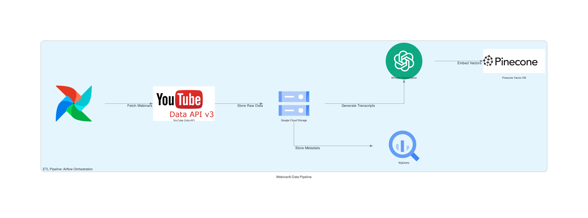

# Final-Project-Proposal

# **WebinarAI - Unleashing the Power of AI for Webinar Intelligence**

### **Overview**
In the digital age, webinars and video content are indispensable for learning and professional development. However, navigating and extracting meaningful insights from hours of unstructured video data can be challenging. **WebinarAI** aims to solve this problem by leveraging cutting-edge AI techniques to process, organize, and enhance webinar content, making it more accessible and actionable.

---

### **Objectives**
- Automate the transcription, processing, and metadata enrichment of webinars.
- Enable users to retrieve specific insights efficiently through semantic search and Q&A capabilities.
- Provide engagement analytics to identify high-value segments in webinars.
- Deliver a scalable and modular solution for large-scale video data processing.

---

### **Key Features**
1. **Automated Transcription**: High-quality transcript generation using OpenAI's Whisper.
2. **Metadata Enrichment**: Adds domain categorization, sentiment analysis, and keyword extraction.
3. **Summarization**: Generates concise, high-level summaries of webinar content.
4. **Q&A Extraction**: Extracts question-answer pairs from transcripts with timestamps.
5. **Semantic Search**: Enables fast and accurate vector-based searches for insights.
6. **Engagement Analytics**: Visualizes user interaction trends and identifies high-value segments.

---

## Architecture Diagram

---
### **Methodology**
#### **Data Sources**
- Creative Commons-licensed webinars and lectures from YouTube.
- Metadata and captions associated with the videos.

#### **Technologies**
- **Transcript Processing**: Whisper by OpenAI for transcript generation and enhancement.
- **Data Enrichment**: spaCy for keyword extraction and domain mapping.
- **NLP Models**: Hugging Face models for summarization (`facebook/bart-large-cnn`) and Q&A extraction (`roberta-base-squad2`).
- **Storage**: Google BigQuery for structured metadata and Pinecone for semantic embedding storage.
- **Pipeline Orchestration**: Airflow for ETL automation.

#### **Architecture Highlights**
1. **ETL Pipeline**:
   - Fetch webinars using the YouTube Data API.
   - Store raw data in Google Cloud Storage.
   - Process transcripts and generate embeddings.
2. **Agent-Based Workflows**:
   - Summarization, Q&A extraction, and topic segmentation.
   - Semantic search and engagement analytics.
3. **User Interaction**:
   - A Streamlit-powered interface for exploring processed content and exporting reports.

---

## Submission Links
- **Codelabs**: [Codelab Documentation](https://codelabs-preview.appspot.com/?file_id=1ljpoSFuprLZ6uKOwIznQ0ntR6E4RsxCyzKnE0S3wszU#0)
- **Updated Codelabs**: [Codelab Documentation](https://codelabs-preview.appspot.com/?file_id=https://docs.google.com/document/d/1_xWgCivVnV8KPgI_saIVdKzCil6ElPJVC36lGPn9z4c/edit?usp=sharing#0)
- **Video Demo** : [Video Demo](demo)

---

### **Expected Outcomes**
#### **Measurable Goals**
- Achieve 95% transcription accuracy.
- Summarize all webinars into concise, readable formats.
- Extract and categorize 80% of relevant Q&A pairs with timestamps.
- Provide semantic search responses in under 500ms.

#### **Anticipated Benefits**
- **Improved Accessibility**: Makes webinar content searchable and more user-friendly.
- **Enhanced Usability**: Summarization, Q&A extraction, and visual analytics empower users.
- **Time Efficiency**: Reduces time spent navigating video content by 70%.
- **Scalability**: Modular architecture supports large datasets and diverse use cases.

---

### **Conclusion**
**WebinarAI** proposes a scalable and innovative solution to address the challenges of unstructured video data. By automating transcription, summarization, and analytics, this platform enhances the usability of webinars for educators, researchers, and professionals. With a modular and efficient architecture, WebinarAI is poised to set a benchmark in webinar intelligence and accessibility.

---

## Team Contributions
| Name                        | Contribution % |
|---------------------------- |----------------|
| Sai Pranavi Jeedigunta      | 33%            | 
| Akanksha Pandey             | 33%            |           
| Kalash Desai                | 33%            |

---

## **Attestation and Contribution Declaration**:
   > WE ATTEST THAT WE HAVEN’T USED ANY OTHER STUDENTS’ WORK IN OUR ASSIGNMENT AND ABIDE BY THE POLICIES LISTED IN THE STUDENT HANDBOOK.
